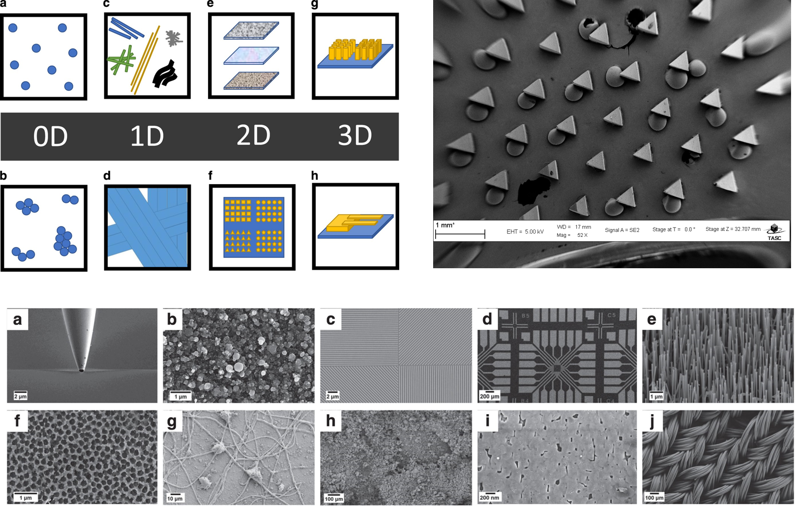

# ARIM-Academy：　機器データ利活用ユースケース
### タイトル：CNNによるSEM画像からのナノ構造体の分類
### 機器：走査電子顕微鏡（SEM）
### 分析：畳み込みニューラルネットワーク（LuNet-5, Xception）

## データセット

『ナノ構造体のSEMデータセット』は、約20,000枚のナノスケールSEM画像を収録したもので、10種類のカテゴリに分類されています。このデータセットは画像認識タスクに適しており、各画像にはそれぞれ対応するカテゴリラベルが付与されています。カテゴリは、0Dオブジェクト（例：粒子）、1D構造（ナノワイヤや繊維）、2D構造（フィルムやコーティングされた表面）、パターン化された表面、そして3D構造（MEMSデバイスやナノピラーなど）に分かれています。

[1] Rossella Aversa, Mohammad Hadi Modarres, Stefano Cozzini, Regina Ciancio & Alberto Chiusole, The first annotated set of scanning electron microscopy images for nanoscience. Scientific Data, 5, 180172 (2018).   https://doi.org/10.1038/sdata.2018.172

